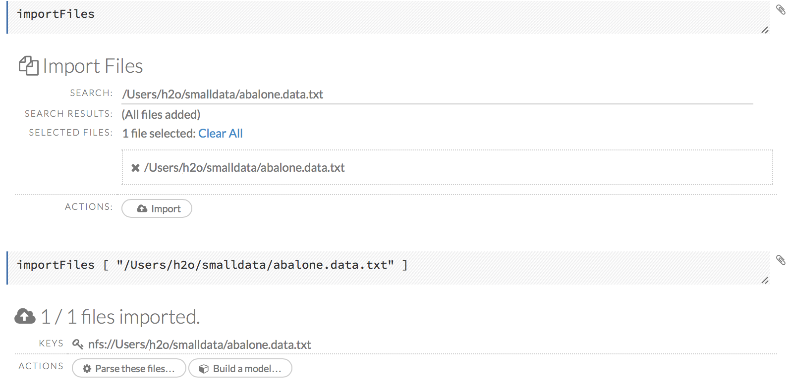
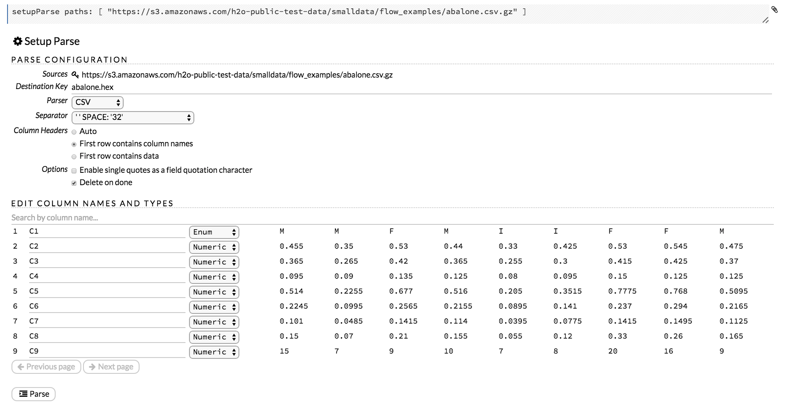
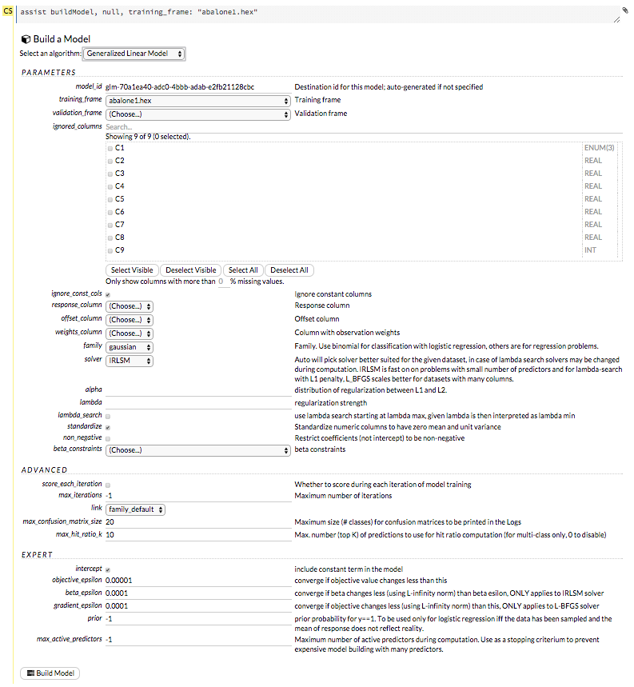
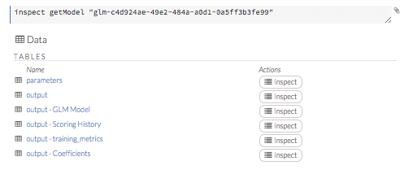

# GLM Tutorial

This tutorial describes how to create a Generalized Linear Analysis (GLM) model using H2O Flow.

Those who have never used H2O before should refer to <a href="https://github.com/h2oai/h2o-dev/blob/master/h2o-docs/src/product/flow/README.md" target="_blank">Getting Started</a> for additional instructions on how to run H2O Flow.

**Note**: GLM in the current version may provide slightly different coefficient values when applying an L1 penalty in comparison with previous versions of H2O.

###Using GLM
Use GLM when the variable of interest relates to predictions or inferences about a rate, an event, or a continuous measurement or for questions about how a set of environmental conditions influence the dependent variable.

Here are some examples:

- "What attributes determine which customers will purchase, and which will not?"
- "Given a set of specific manufacturing conditions, how many units produced will fail?"
- "How many customers will contact help support in a given time frame?"

### Getting Started
This tutorial uses a publicly available data set that can be found at the UCI Machine Learning Repository: <a href="http://archive.ics.uci.edu/ml/machine-learning-databases/abalone/" target="_blank">http://archive.ics.uci.edu/ml/machine-learning-databases/abalone/</a>.

The original data are the Abalone data, available from UCI Machine Learning Repository. They are composed of 4177 observations on 9 attributes. All attributes are real valued, and continuous, except for Sex and Rings, found in columns 0 and 8 respectively.
Sex is categorical with 3 levels (male, female, and infant), and Rings is an integer valued count.

If you don't have any data of your own to work with, you can find some example datasets at <a href="http://data.h2o.ai" target="_blank">http://data.h2o.ai</a>.

####Importing Data
Before creating a model, import data into H2O:

0. Click the **Assist Me!** button (the last button in the row of buttons below the menus). 

 

0. Click the **importFiles** link and enter the file path to the dataset in the **Search** entry field.  
0. Click the **Add all** link to add the file to the import queue, then click the **Import** button. 

  

####Parsing Data
Now, parse the imported data: 

0. Click the **Parse these files...** button. 

  >**Note**: The default options typically do not need to be changed unless the data does not parse correctly. 

0. From the drop-down **Parser** list, select the file type of the data set (Auto, XLS, CSV, or SVMLight). 
0. If the data uses a separator, select it from the drop-down **Separator** list. 
0. If the data uses a column header as the first row, select the **First row contains column names** radio button. If the first row contains data, select the **First row contains data** radio button. To have H2O automatically determine if the first row of the dataset contains column names or data, select the **Auto** radio button. 
0. If the data uses apostrophes ( `'` - also known as single quotes), check the **Enable single quotes as a field quotation character** checkbox. 
0. Review the data in the **Edit Column Names and Types** section, then click the **Parse** button.  

  

  **NOTE**: Make sure the parse is complete by confirming progress is 100% before continuing to the next step, model building. For small datasets, this should only take a few seconds, but larger datasets take longer to parse.

### Building a Model

0. Once data are parsed, click the **View** button, then click the **Build Model** button. 
0. Select `Generalized Linear Model` from the drop-down **Select an algorithm** menu, then click the **Build model** button.  
0. If the parsed Abalone .hex file is not already listed in the **Training_frame** drop-down list, select it. Otherwise, continue to the next step. 
0. To generate a scoring history, select the abalone.hex file from the **Validation_frame** drop-down list.  
0. In the **Response** field, select the column associated with the Whole Weight variable (`C9`).
0. From the drop-down **Family** menu, select `gaussian`. 
0. Enter `0.3` in the **Alpha** field. The alpha parameter is the mixing parameter for the L1 and L2 penalty.
0. Enter `.002` in the **Lambda** field.
0. Check the **Lambda_search** checkbox.  
0. Click the **Build Model** button.

 

### GLM Results

To view the results, click the **View** button. The GLM output includes coefficients (as well as normalized coefficients when standardization is requested). The output also includes: 

- Model parameters (hidden)
- A graph of the scoring history (objective vs. iteration) 
- Output (model category, validation metrics, and standardized coefficients magnitude)
- GLM model summary (family, link, regularization, number of total predictors, number of active predictors, number of iterations, training frame)
-  Scoring history in tabular form (timestamp, duration, iteration, log likelihood, objective)
-  Training metrics (model, model checksum, frame, frame checksum, description, model category, scoring time, predictions, MSE, r2, residual deviance, null deviance, AIC, null degrees of freedom, residual degrees of freedom) 
-  Coefficients
-  Preview POJO

To view more details, click the **Inspect** button. 

 
 

