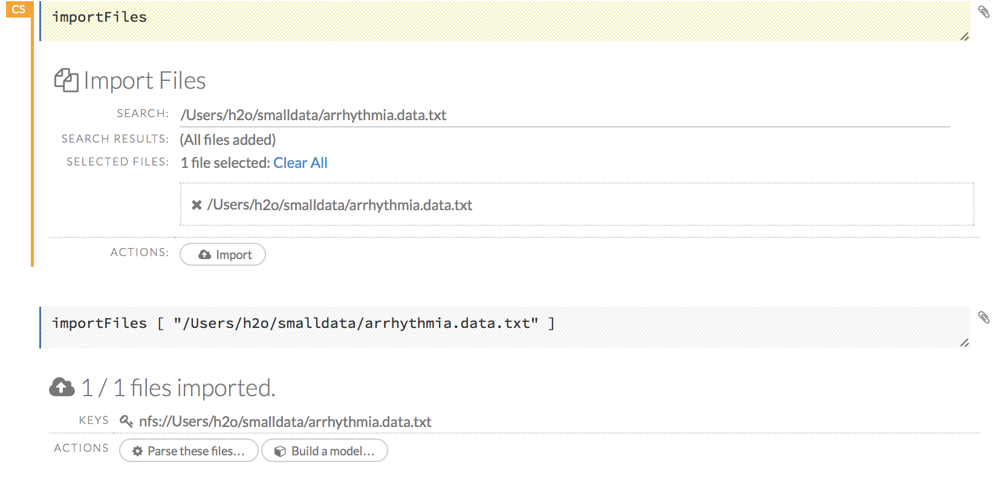
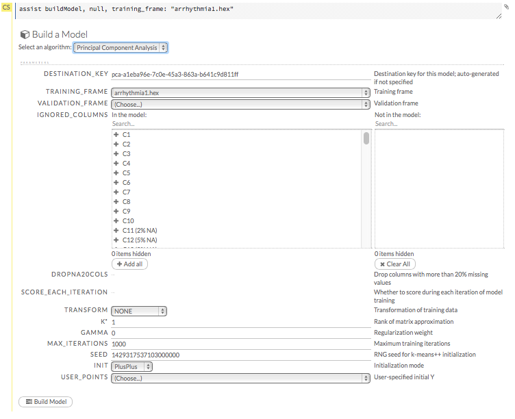

# PCA Tutorial

This tutorial walks new users through the process of creating a Principal Components Analysis (PCA) model. 

Those who have never used H2O before should refer to <a href="https://github.com/h2oai/h2o-dev/blob/master/h2o-docs/src/product/flow/README.md" target="_blank">Getting Started</a> for additional instructions on how to run H2O Flow.

For more details on the math behind H2O's implementation of PCA, refer to <a href="http://h2o-release.s3.amazonaws.com/h2o/{{branch_name}}/{{build_number}}/docs-website/h2o-docs/index.html#Data%20Science%20Algorithms-PCA" target="_blank">PCA Data Science</a>.

### When to Use PCA
PCA is used to reduce dimensions and solve issues of multicollinearity in high dimension data.

### Getting Started

This tutorial uses a publicly available data set that can be found at:
<a href="http://archive.ics.uci.edu/ml/datasets/Arrhythmia" target="_blank">http://archive.ics.uci.edu/ml/datasets/Arrhythmia</a>.

The original data are the Arrhythmia data set made available by UCI
Machine Learning Repository. They are composed of 452 observations and
279 attributes.

If you don't have any data of your own to work with, you can find some example datasets at <a href="http://data.h2o.ai" target="_blank">http://data.h2o.ai</a>.

####Importing Data
Before creating a model, import data into H2O:

0. Click the **Assist Me!** button in the *Help* tab in the sidebar on the right side of the page. 

  
0. Click the **importFiles** link and enter the file path to the dataset in the **Search** entry field. 
0. Click the **Add all** link to add the file to the import queue, then click the **Import** button. 
  

####Parsing Data
Now, parse the imported data: 

0. Click the **Parse these files...** button. 

  >**Note**: The default options typically do not need to be changed unless the data does not parse correctly. 

0. From the drop-down **Parser** list, select the file type of the data set (Auto, XLS, CSV, or SVMLight). 
0. If the data uses a separator, select it from the drop-down **Separator** list. 
0. If the data uses a column header as the first row, select the **First row contains column names** radio button. If the first row contains data, select the **First row contains data** radio button. You can also select the **Auto** radio button to have H2O automatically determine if the first row of the dataset contains the column names or data. 
0. If the data uses apostrophes ( `'` - also known as single quotes), check the **Enable single quotes as a field quotation character** checkbox. 
0. Review the data in the **Edit Column Names and Types** section, then click the **Parse** button. 

  

  **NOTE**: Make sure the parse is complete by clicking the **View Job** button and confirming progress is 100% before continuing to the next step, model building. For small datasets, this should only take a few seconds, but larger datasets take longer to parse.

### Building a Model

0. Once data are parsed, click the **View** button, then click the **Build Model** button. 
0. Select `Principal Component Analysis` from the drop-down **Select an algorithm** menu, then click the **Build model** button. 
0. If the parsed arrhythmia.hex file is not already listed in the **Training_frame** drop-down list, select it. Otherwise, continue to the next step. 
0. From the drop-down **pca_method** menu, select the method for computing PCA. For this example, select *GramSVD*. The *GramSVD* option forms the Gram matrix of the training frame via a distributed computation, then computes the singular value decomposition (SVD) of the Gram locally using the JAMA package. The principal component vectors and standard deviations are recovered from the SVD. 
0. In the **K** field, specify the number of clusters. For this example, enter `3`.  
0. In the **Max_iterations** field, specify the maximum number of iterations. For this example, enter `100`. 
0. Click the **Build Model** button. 

### PCA Results

The output for PCA includes the following: 

- Model parameters
- Output (model category, model summary, scoring history, training metrics, validation metrics, iterations)
- Importance of components
- Training metrics
- Rotation
- Preview POJO
